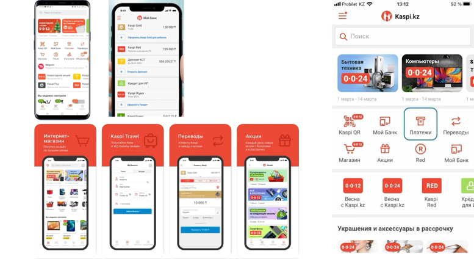
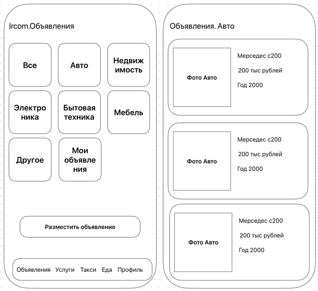
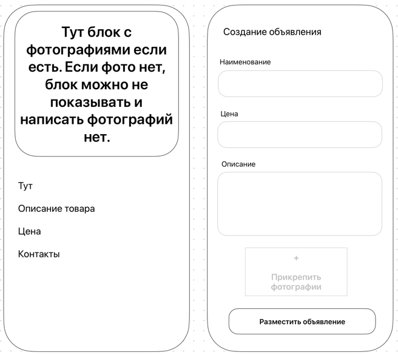
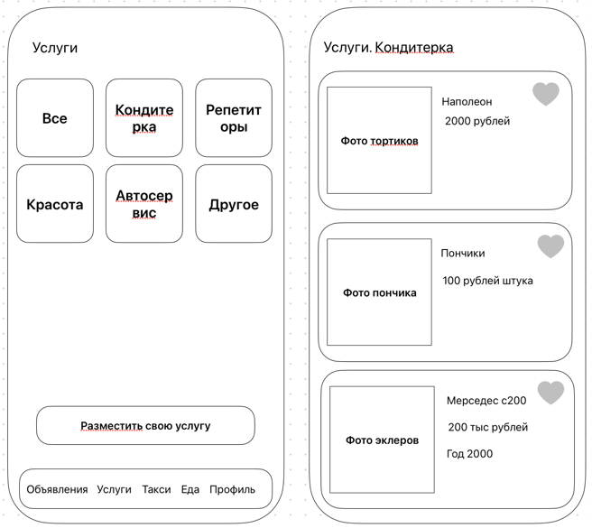
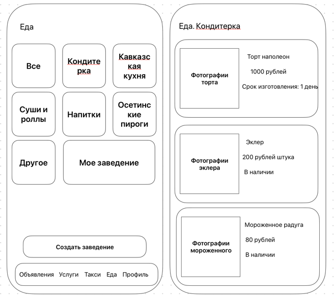
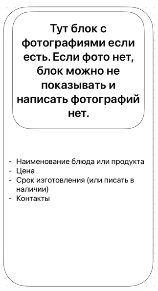
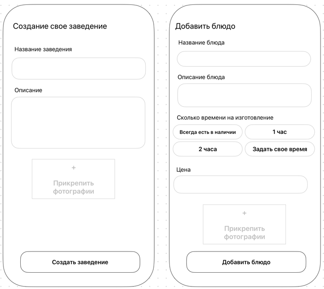

# ircom

Цель проекта

Создать супер-приложение с названием ircom для Южной Осетии, который объединяет функционал следующих направлений:

- Объявления - Раздел по продаже б/у вещей, наподобие Авито
- Услуги - Раздел с услугами, такими как выпечка тортов, починка авто, репетиторство и так далее
- Такси - Раздел, где таксисты размещают свои услуги, а пассажиры могут выбрать таксиста по отзывам, цене и связаться с
  ним
- Еда - Раздел, где заведения могут размещать то, что они могут приготовить, а пользователи выбрать, почитать отзывы,
  сравнить цены и выбрать подходящий вариант, связаться и заказать еду

Общий вид приложения
В нижней части экрана есть кнопки для перехода между разделами

- Объявления
- Услуги
- Такси
- Еда
- Профиль

## Дизайн приложения

Общий дизайн приложения аналогичен приложению Kaspi. Ниже скрины их этого приложения для примера. Это просто дизайн, не
надо копировать функционал!

### Объявления

#### Категории

В раздел объявления переходят по щелчку на соответствующую кнопку. При переходе в объявления видим категории объявлений:

- Все
- Авто
- Недвижимость
- Электроника
- Бытовая техника
- Мебель
- Другое
- Мои объявления (Если пользователь авторизован и у него есть объявления)
  Так же есть кнопка разместить объявление. Если пользователь авторизован, он приходит в форму для создания объявления.
  Если нет, система предлагает пользователю авторизовать или зарегаться если нет

#### Список

При переходе на определенную категорию пользователь видит список объявлений с возможностью

- Сортировки по цене, дате размещения, зайлайкан или нет
- Ставить лайк объявлениям если пользователь авторизован. Если нет, предложить авторизацию или регистрацию
- Фотки карточек можно пролистывать прямо в списке

В карточках содержится след информация:

- Фото, которое можно пролистывать прямо в списке
- Наименование того что продается
- Цена
- Дата размещения (например, два дня назад или неделю назад)
- Начало описания, которое обрывается многоточием…

  

#### Карточка

При переходе в карточку товара пользователь видит

- блок с фотографиями, которые можно открыть на весь экран
- Контакт WhatsАpp если указан
- Контакт Telegram если указан
- Номер телефона если указано
- Так же в карточке можно поставить лайк товару

##### Создание объявления

При создании объявления пользователь должен заполнить следующие поля

- Наименование того что он продает (не слишком длинное, не слишком короткое)
- Цена (в рублях, должна валидироваться)
- Описание (не сильно короткое, не сильно длинное)
- Возможность прикрепить до 10 фотографий. Фотографии должны сжиматься и занимать минимум места
- Кнопка разместить объявление
  При создании услуги предусмотреть возможность кнопок с соответствующими наименованиями того что чаще всего продают,
  скажем автомобиль,
  В категории недвижимость есть дополнительная кнопка аренда или покупка.

### Услуги

(Дизайн показан примерный. Он должен быть выше как в приложении Капи)

#### Категории

В услугах аналогично объявлениям есть категории:

- Все
- Кондитерка
- Репетиторы
- Красота
- Автосервис
- Другое
- Так же есть кнопка разместить свою услугу. Если пользователь авторизован, при нажатии на эту кнопку открывается форма
  для создания услуги. Если пользователь не авторизован, приложение предлагает авторизоваться или зарегистрироваться
  если нет аккаунта

#### Список

При переходе в определенную категорию пользователь видит список услуг с возможностью

- фильтрации услуг по
- цене,
- дате размещения,
- Зайлайкан или нет
- перехода в определенную карточку,
- ставить лайк услуге,
- Фотки карточек можно пролистывать прямо в списке

В карточках содержится след информация:

- Фото, которое можно пролистывать прямо в списке
- Наименование услуги
- Цена
- Дата размещения (например, два дня назад или неделю назад)
- Начало описания, которое обрывается многоточием…

#### Карточка

При переходе в карточку услуги пользователь видит

- блок с фотографиями, которые можно открыть на весь экран
- Контакт WhatsАpp если указан
- Контакт Telegram если указан
- Номер телефона если указано
- Так же в карточке можно поставить лайк услуге

#### Создание услуги

При создании услуги пользователь должен заполнить следующие поля

- Наименование услуги (не слишком длинное, не слишком короткое)
- Цена (в рублях, должна валидироваться)
- Описание (не сильно короткое, не сильно длинное)
- Возможность прикрепить до 10 фотографий. Фотографии должны сжиматься и занимать минимум места
- Кнопка разместить объявление

### Еда

#### Категории

При переходе в раздел еде пользователь видит категории еды.

- Если у пользователя есть свое заведение, видит среди категорий свое заведение. Если у пользователя нет заведения, он
- видит кнопку Создать заведение
- Есть след категории:
- Все
- Кавказская кухня
- Суши и роллы
- Осетинские пироги
- Бургеры
- Другое

#### Список

При переходе в категорию пользователь видит список вариантов еды с возможность

- Сортировки по цене
- Ставить лайки (если авторизован, если нет, появляется форма авторизации)
- Сортировка по избранным
- Сортировка по скорости изготовления. В первую очередь по наличию
- Листать фото вариантов прямо в списке
- Сортировать есть ли доставка

#### Карточка

При переводе в карточку еды пользователь может

- листать фотографии еды прямо из карточки или перейти в полноэкранный режим
- Добавлять в избранное
- Видит контакты WhatsApp или Telegram или номер телефона. Контакт кликабельные

#### Создать заведение

Пользователь может создать заведение
При создании заведение доступны следующие поля

- Название заведения
- Описание (или чем ваше заведение лучше конкурентов)
- Прикрепить логотип своего заведения

После создания заведения пользователь видит свое заведение в профиле, в категориях еды, и может добавит блюдо.
При добавлении блюда пользователь может заполнить следующие поля:

- Название блюда
- Описание блюда
- Выбрать или ввести сколько времени будет готовиться блюдо или может оно есть всегда в наличии
- Цена
- Есть ли доставка

После заполнения пользователь видит свое заведение и блюда которые там есть. Он может всегда отредактировать или удалить
или добавить новые блюда

