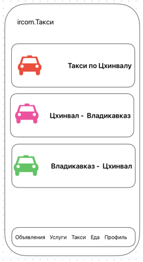
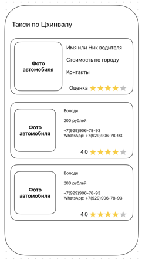
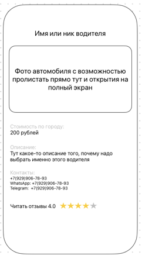
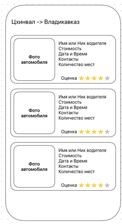
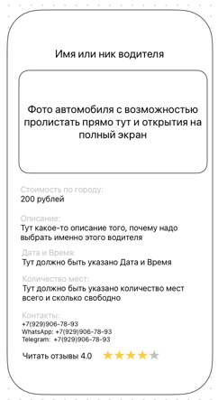

# ircom

## Цель проекта
Создать супер-приложение **ircom** для Южной Осетии, которое объединяет функционал следующих направлений:
- Объявления (продажа б/у вещей, аналог Avito)
- Услуги (поиск и размещение услуг)
- Такси (поиск водителей и связь с ними)
- Еда (поиск заведений и блюд)

## Общий вид приложения
В нижней части экрана размещены кнопки перехода между разделами:
- Объявления
- Услуги
- Такси
- Еда
- Профиль

## Дизайн приложения
Общий визуальный стиль ориентирован на приложение Kaspi (как референс внешнего вида). Функционал Kaspi копировать не нужно.

Общие UX-правила для всех разделов:
- Если пользователь не авторизован, просмотр списков и карточек доступен.
- Действия `Разместить`, `Лайк/Избранное`, `Создать заведение`, `Добавить блюдо` доступны только авторизованным.
- При попытке защищенного действия без авторизации показывать экран: `Войти / Зарегистрироваться`.
- Контакты (WhatsApp, Telegram, телефон) отображаются только если заполнены и должны быть кликабельными.
- Фото в публикациях: до 10 штук, сжатие перед загрузкой обязательно.

## Объявления

### Категории
В разделе доступны категории:
- Все
- Авто
- Недвижимость
- Электроника
- Бытовая техника
- Мебель
- Другое
- Мои объявления (показывать только авторизованному пользователю и только если у него есть объявления)

Также есть кнопка `Разместить объявление`:
- если пользователь авторизован, открывается форма создания объявления;
- если не авторизован, показывается предложение авторизоваться или зарегистрироваться.

### Список
При переходе в категорию пользователь видит список объявлений с возможностями:
- сортировка по цене;
- сортировка по дате размещения;
- фильтр/сортировка по избранному (лайкнуто или нет);
- поставить лайк объявлению (только для авторизованных);
- листать фото прямо в карточке списка.

Карточка в списке содержит:
- фото (свайп);
- наименование товара;
- цену;
- дату размещения (например, «2 дня назад»);
- начало описания с обрезкой и многоточием.

### Карточка
В детальной карточке объявления пользователь видит:
- галерею фотографий с полноэкранным просмотром;
- WhatsApp (если указан);
- Telegram (если указан);
- номер телефона (если указан);
- кнопку лайка/добавления в избранное.

### Создание объявления
При создании объявления доступны поля:
- наименование товара;
- цена (в рублях);
- описание;
- фото (до 10);
- категория.

Валидации:
- наименование: обязательное, длина 3-80 символов;
- цена: обязательное, число больше 0;
- описание: обязательное, длина 10-2000 символов;
- фото: максимум 10.

Дополнительно:
- для категории `Недвижимость` добавить выбор типа: `Аренда` / `Покупка`;
- предусмотреть быстрые подсказки по часто публикуемым типам товаров.

## Услуги

### Категории
В разделе доступны категории:
- Все
- Кондитерка
- Репетиторы
- Красота
- Автосервис
- Другое

Также есть кнопка `Разместить услугу`:
- если пользователь авторизован, открывается форма создания услуги;
- если не авторизован, показывается предложение авторизоваться или зарегистрироваться.

### Список
При переходе в категорию пользователь видит список услуг с возможностями:
- сортировка/фильтрация по цене;
- сортировка по дате размещения;
- фильтр/сортировка по избранному;
- переход в карточку услуги;
- поставить лайк услуге (для авторизованных);
- листать фото прямо в карточке списка.

Карточка в списке содержит:
- фото (свайп);
- наименование услуги;
- цену;
- дату размещения;
- начало описания с обрезкой и многоточием.

### Карточка
В детальной карточке услуги пользователь видит:
- галерею фото с полноэкранным просмотром;
- WhatsApp (если указан);
- Telegram (если указан);
- номер телефона (если указан);
- кнопку лайка/добавления в избранное.

### Создание услуги
При создании услуги доступны поля:
- наименование услуги;
- цена (в рублях);
- описание;
- фото (до 10);
- категория.

Валидации:
- наименование: обязательное, длина 3-80 символов;
- цена: обязательное, число больше 0;
- описание: обязательное, длина 10-2000 символов;
- фото: максимум 10.

## Такси

### Категории
В разделе доступны категории (направления):
- Такси по Цхинвалу
- Цхинвал -> Владикавказ
- Владикавказ -> Цхинвал

### Городское такси (Такси по Цхинвалу)

#### Список
При переходе в категорию `Такси по Цхинвалу` пользователь видит список водительских предложений с возможностями:
- сортировка по цене;
- сортировка по рейтингу;
- фильтр по избранному (если добавлено);
- переход в подробную карточку.

Карточка в списке содержит:
- фото автомобиля;
- имя/ник водителя;
- стоимость по городу;
- контакты;
- рейтинг и количество отзывов;
- краткое описание (опционально).

#### Подробная карточка
В детальной карточке водительского предложения:
- имя/ник водителя;
- фото автомобиля с возможностью пролистывания и полноэкранного открытия;
- стоимость по городу;
- описание;
- WhatsApp/Telegram/телефон (если указаны);
- рейтинг и отзывы;
- возможность сразу связаться с водителем;
- возможность добавить в избранное.

### Междугороднее такси (Цхинвал -> Владикавказ, Владикавказ -> Цхинвал)

#### Список
При переходе в одну из междугородних категорий пользователь видит список водительских предложений с возможностями:
- сортировка по цене;
- сортировка по рейтингу;
- фильтр по избранному (если добавлено);
- переход в подробную карточку.

Карточка в списке содержит:
- фото автомобиля;
- имя/ник водителя;
- стоимость;
- дату и время выезда;
- контакты;
- количество мест;
- рейтинг.

#### Подробная карточка
В детальной карточке междугороднего предложения отображается:
- имя/ник водителя;
- фото автомобиля с возможностью пролистывания и полноэкранного открытия;
- стоимость;
- дату и время выезда;
- контакты;
- количество мест (всего и свободно);
- рейтинг и отзывы;
- возможность сразу связаться с водителем;
- возможность добавить в избранное.

### Создание предложения (для водителя)
Если пользователь хочет размещать предложение как водитель, форма содержит:
- категорию/направление (`Такси по Цхинвалу`, `Цхинвал -> Владикавказ`, `Владикавказ -> Цхинвал`);
- имя или название профиля;
- фото автомобиля;
- телефон (обязательно);
- дополнительные контакты (WhatsApp/Telegram);
- описание услуги;
- стоимость.

Для межгородских направлений дополнительно:
- дата и время выезда;
- количество мест.

Валидации:
- имя: обязательное, длина 2-60 символов;
- телефон: обязательный, формат номера;
- стоимость: число больше 0;
- количество мест: целое число больше 0 (для межгорода);
- дата и время: обязательны для межгорода.

Примечание: онлайн-заказ поездки, трекинг маршрута, in-app оплата и диспетчеризация не входят в текущий MVP.

## Еда

### Категории
При переходе в раздел пользователь видит:
- Все
- Кавказская кухня
- Суши и роллы
- Осетинские пироги
- Бургеры
- Другое

Логика владельца заведения:
- если у пользователя есть свое заведение, он видит его в разделе;
- если у пользователя нет заведения, отображается кнопка `Создать заведение`.

### Список
При переходе в категорию пользователь видит список блюд/предложений с возможностями:
- сортировка по цене;
- фильтр/сортировка по избранному;
- сортировка по времени приготовления;
- фильтр по наличию (`В наличии`);
- фильтр `Есть доставка`;
- листать фото в карточке списка.

### Карточка
В карточке блюда/предложения пользователь может:
- листать фотографии и открывать их в полноэкранном режиме;
- добавлять блюдо в избранное;
- видеть кликабельные контакты (WhatsApp, Telegram, телефон), если заполнены.

### Создать заведение
Пользователь может создать заведение. Поля формы:
- название заведения;
- описание (чем заведение лучше конкурентов);
- логотип.

После создания заведения пользователь:
- видит его в профиле;
- видит его в разделе `Еда`;
- может добавлять, редактировать и удалять блюда.

### Добавление блюда
При добавлении блюда доступны поля:
- название блюда;
- описание блюда;
- время приготовления (в минутах) или флаг `Всегда в наличии`;
- цена;
- флаг `Есть доставка`;
- фото (опционально, до 10).

Валидации:
- название: обязательное, длина 2-100 символов;
- описание: 0-2000 символов;
- цена: обязательное, число больше 0;
- время приготовления: положительное число минут (если не выбрано `Всегда в наличии`).

## Профиль
В разделе `Профиль` пользователь может:
- войти/выйти из аккаунта;
- просматривать и редактировать базовые данные (имя, контакты);
- видеть свои объявления;
- видеть свои услуги;
- видеть свое заведение и управлять блюдами (если есть заведение).

## Критерии приемки

### Общие
- Нижняя навигация содержит 5 разделов и корректно переключает экраны.
- Неавторизованный пользователь при защищенных действиях направляется на вход/регистрацию.
- Контакты в карточках кликабельны и открывают соответствующее приложение/звонок.

### Объявления
- Категории отображаются в соответствии с ТЗ.
- Пользователь может создать объявление с валидными данными.
- Лента поддерживает сортировки, лайки и пролистывание фото.

### Услуги
- Категории отображаются в соответствии с ТЗ.
- Пользователь может создать услугу с валидными данными.
- Лента поддерживает сортировки, лайки и пролистывание фото.

### Такси
- Пользователь видит 3 категории такси: `Такси по Цхинвалу`, `Цхинвал -> Владикавказ`, `Владикавказ -> Цхинвал`.
- В списке работают сортировки по цене и рейтингу.
- Для межгородских предложений отображаются дата/время и количество мест.
- Пользователь может открыть карточку водителя и связаться с ним по контакту.

### Еда
- Пользователь без заведения видит кнопку `Создать заведение`.
- После создания заведения владелец может добавлять/редактировать/удалять блюда.
- В списке еды работают фильтры по цене, избранному, наличию, времени и доставке.
